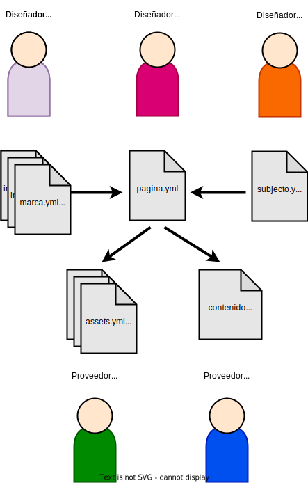

# nous-static-web


Implementación de [nous](https://github.com/noumanity/nous) por un sitio web.


`nous-static-web` esta un herramienta para generar sitio web a partir de las información facilitada por los usarios o personas.

Cada persona tiene una responsabilidad especifica. 

**Diseñador de la imagen**: la aparencia visual del sitio web.

**Diseñador de pagina**: los secciones y otra elementos en la pagina web.

**Diseñador del contenido**: nombre de los secciones y la intencion de cada sectiones.

**Proveedor del contenido visual**: los imagenes, videos, ...

**Proveedor del contenido textual**: textos y otras palabras.





# Uso

```
# Generar un sitio web con el plantilla 'vitrine_web'
# defecto diseno y contenido 
nous g vitrine_web

# y miralo
firefox build/index.html
```


```
# Generar un sitio con otra contenido

git clone git@github.com:noumanity/vitrine-web
cd vitrine-web

nous g -c contenido.yml vitrine-web
```


## Instalación


### Con Docker

Comandos configurados están disponibles en el script `./dev`.
```
# construye e inicia nous
./dev up

# usa nous
./dev sh nous g vitrine_web 

# o con alias
alias nous="$(pwd)/dev sh nous"
nous g vitrine_web 

# granja y destruye el servicio
./dev down
```

Los archivos se pueden editar localmente.

Y podemos entrar en el contenedor

```
./dev sh
```

### En Linux

```
git clone git@github.com:noumanity/nous-static-web
cd nous-static-web
./setup.sh
echo "export PATH=$PATH:$(pwd)/bin" >> ~/.bashrc
. ~/.bashrc
````


# Ejemplo

## Pagina

Una página describe como hacer una pagina web. Un  pagina tiene todo lo necesita:

  - los plantillas
  - los schemas

Y datos por defecto:
  - contenido textual
  - contenido visual

Para construir una página web con los datos por defecto:

```
nous pagina RUTA_POR_PAGINA_REPISOTORIO
```


