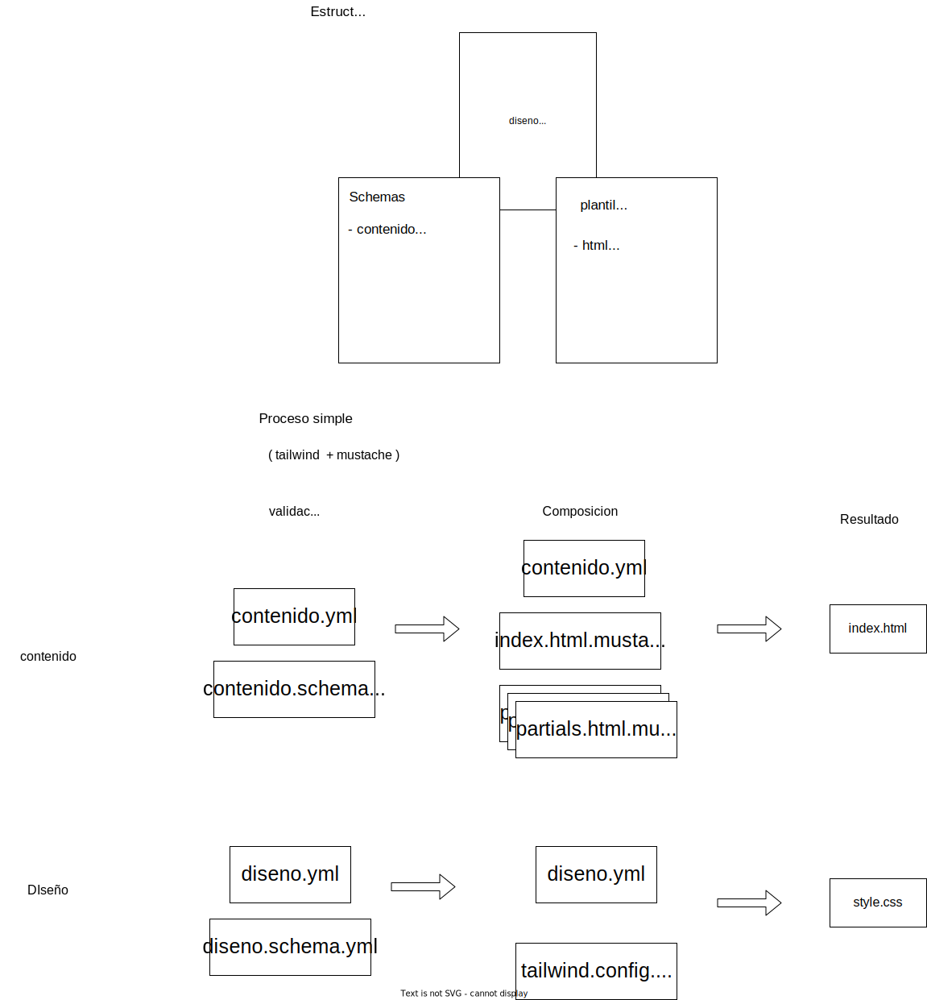

# Ejemplo: un blog


```
# dependencias: yajvs, npm, mustache

./dev
firefox build/dist/index.html 

```


## Pagina plantilla

Una página describe como hacer una pagina web. Aquí, este pagina es un blog. La pagina plantilla tiene todo lo que necesita 
para realisar una pagina web:

  - los plantillas html, etc.
  - los schemas para describir los datos necesarios

Hay varios tipos de datos:
  - contenido textual
  - contenido visual
    - archivos ...


El proceso de construcción es el siguiente:

  - validar que los datos son compatibles con el modelo de pagina
  - Composición de archivos a partir de plantillas
  - almacenar y utilizar los archivos generados para ver el sitio web



